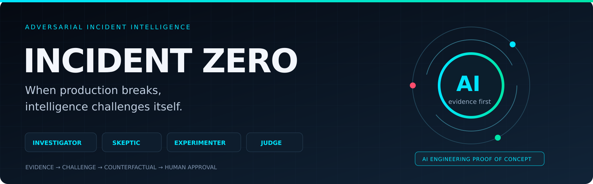
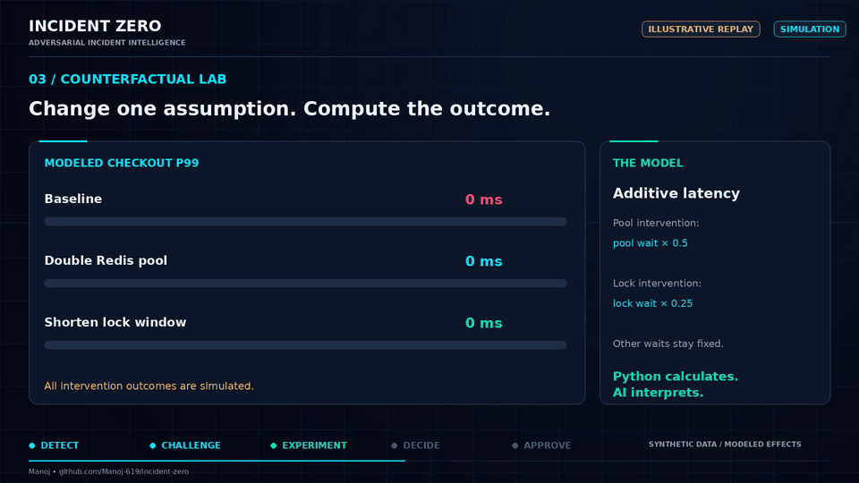
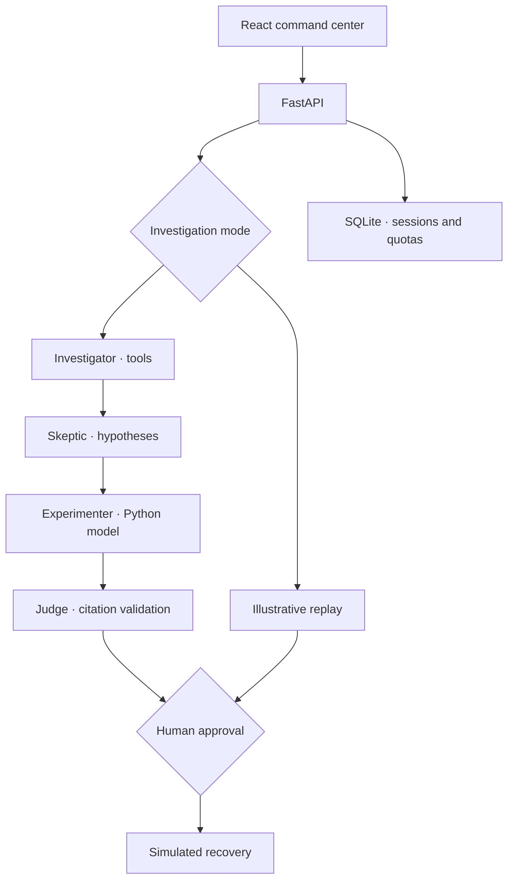

<p align="center">
  
</p>

<p align="center">
  <strong>Investigate the incident. Challenge the hypothesis. Test the intervention.</strong><br />
  Evidence-driven AI incident investigation with an explicit human approval gate.
</p>

<p align="center">
  <a href="https://github.com/Manoj-619/incident-zero/actions/workflows/ci.yml"></a>
  
  
  
  
  
</p>

<p align="center">
  <a href="#the-demo">Watch the workflow</a> ·
  <a href="#run-it">Run locally</a> ·
  <a href="#under-the-hood">Architecture</a> ·
  <a href="docs/OPERATIONS.md">Operating guide</a>
</p>

---

## An alert is a starting point. Evidence earns the verdict.

Production incidents reward fast answers. They also punish the wrong ones.

**INCIDENT ZERO** explores a more rigorous AI workflow: gather telemetry, challenge the leading explanation, compute a controlled counterfactual, and compare the evidence before proposing a response.

Four specialized roles work through a bounded, sequential investigation. Python executes the tools and simulation. Gemini generates the live assessments. The human decides whether to apply the proposed **simulated** intervention.

> **Project status:** A hardened proof of concept on synthetic telemetry. Replay works without an API key. Live mode integrates Gemini, but recent generation attempts returned provider overload errors; a complete live investigation has not yet been verified. No production infrastructure is connected.

## The demo

<p align="center">
  
  <br /><sub>Illustrative workflow animation. Synthetic data and simulated effects; not recorded live AI inference.</sub>
</p>

### A misleading alert. A better question.

A checkout alert initially suggests **Redis connection pool exhaustion**. The collected telemetry gives the Skeptic a reason to look elsewhere:

| Collected signal | Synthetic value | What it suggests |
| :-- | --: | :-- |
| Checkout P99 latency | **2,140 ms** | The checkout path is degraded. |
| Redis pool wait | **4 ms** | Pool waiting contributes little to the reported latency. |
| Redis active / maximum connections | **12 / 50** | The pool is not visibly at capacity. |
| Database lock wait | **1,820 ms** | Database waiting warrants investigation. |
| Postgres lock-wait trace share | **71%** | Lock time dominates the trace summary. |

The counterfactual model then compares interventions:

| Modeled condition | Checkout P99 |
| :-- | --: |
| Baseline | **2,140 ms** |
| Double Redis pool capacity | **2,138 ms** |
| Shorten the database lock window | **775 ms** |

The illustrative replay favors **PostgreSQL row-lock contention during settlement**. These comparisons test explicit simulation assumptions; they do not establish real-world causality.

## The investigation engine

| Role | Responsibility | Reviewable output |
| :-- | :-- | :-- |
| **Investigator** | Select allowlisted tools and assess the returned telemetry. | Initial hypothesis, collected evidence, heuristic confidence. |
| **Skeptic** | Challenge causal assumptions and compare an alternative explanation. | Supporting evidence, contradictions, revised assessment. |
| **Experimenter** | Select a permitted counterfactual intervention. | Deterministic Python-computed outcome. |
| **Judge** | Compare hypotheses, citations, and experiment results. | Cited verdict or an undetermined result. |

### Engineering choices that matter

- **Evidence has an identity.** Tool outputs receive stable content-derived IDs; unsupported model citations stop the workflow.
- **Live failure stays visible.** Provider errors produce a failed investigation, rather than a substituted diagnosis.
- **Experiments execute in Python.** The model selects an allowlisted intervention; it does not invent metric values or execute arbitrary code.
- **Approval is explicit.** Applying a simulation is session-bound, transactional, and safe to repeat.
- **Public access defaults to replay.** The provider key stays on the server; controlled live access uses a separate operator secret.
- **Work is bounded.** Limits cover model requests, tool invocations, output tokens, wall time, and global live starts.

## Under the hood



**React 19 + TypeScript + Vite** present the workflow. **FastAPI + Pydantic** validate requests and model outputs. The official **Google Gen AI SDK** handles live inference. **SQLite** persists investigations and atomically reserves quotas on one host. **Nginx + Docker Compose** package the application.

The roles run sequentially. Events are returned after investigation completion; this version does not stream live agent activity.

## Run it

### Fastest path: Docker

```bash
git clone https://github.com/Manoj-619/incident-zero.git
cd incident-zero
cp .env.example .env
docker compose up --build -d
```

Open **http://localhost:5173** and choose **Run replay demo**. No API key is required for replay.

<details>
<summary><strong>Run without Docker</strong> — Python 3.12 and Node 22</summary>

Backend:

```bash
python -m venv .venv
source .venv/bin/activate
pip install -r backend/requirements.txt
cp .env.example .env
cd backend
uvicorn app.main:app --port 8000 --no-proxy-headers
```

Frontend, in a second terminal:

```bash
cd incident-zero/frontend
npm ci
npm run dev
```

Open **http://localhost:5173**.

</details>

### Controlled live AI

Set these on the server, using a local ignored `.env` file or your host's secret settings:

```dotenv
GEMINI_API_KEY=your_server_side_key
GEMINI_MODEL=gemini-3.8-flash
ALLOW_PUBLIC_LIVE=false
DEMO_SECRET=your_long_random_operator_secret
LIVE_DAILY_CAP=5
```

Restart the backend, enter the **operator secret** in the app, then launch a live investigation. Choose a model available to your account. The Gemini key and operator secret serve different purposes; neither belongs in frontend build variables.

The configured limits bound requests and tokens, not currency spending. Model availability, free-tier quotas, and provider billing controls must be verified for your project.

## Verification

```bash
python -m pytest backend/tests -q
pip check
cd frontend
npm ci
npm run build
```

**32 local tests passed** after the model and provider-error fixes. Coverage includes tool validation, unsupported citations, answer-key separation, deterministic simulations, anonymous session isolation, atomic quotas, approval idempotency, provider failure handling, and a complete workflow with a **mocked** provider.

GitHub CI verifies backend tests, dependency compatibility, the frontend build, and Docker startup with HTTP checks for replay, approval, and recovery. The status badge above reflects the current workflow result.

## Scope, honestly

| Available now | Needed for an enterprise rollout |
| :-- | :-- |
| Synthetic checkout incident and illustrative replay | Real telemetry and incident ingestion |
| Bounded Gemini-based investigation code | Successful live validation and model evaluation suite |
| Anonymous session capabilities and operator secret | Enterprise identity and role-based authorization |
| SQLite persistence and single-host quotas | Distributed storage and queued execution |
| Deterministic counterfactual model | Validated causal models and real operational evidence |
| Human-approved simulated remediation | Separately engineered production action controls |

The current fixture contains **three log entries and aggregate metrics**. Confidence scores are heuristic. Citation checks establish provenance, not logical entailment. SQLite quotas require a shared local database file on one host. These are deliberate limits of the current demonstration.

See the [operating guide](docs/OPERATIONS.md) for expiry, budget limits, HTTPS deployment, persistent storage, and operational constraints.

---

<p align="center">
  <strong>Challenge the diagnosis. Test the assumption. Keep the evidence.</strong><br />
  Built by <a href="https://github.com/Manoj-619">Manoj</a> · INCIDENT ZERO
</p>
