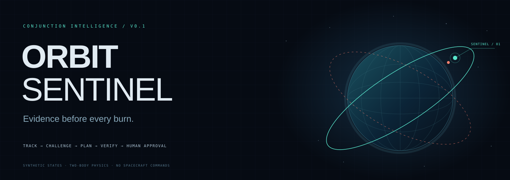
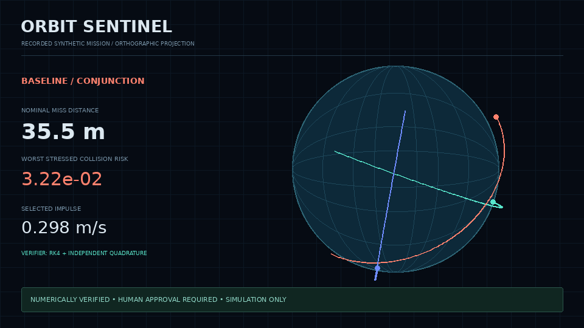
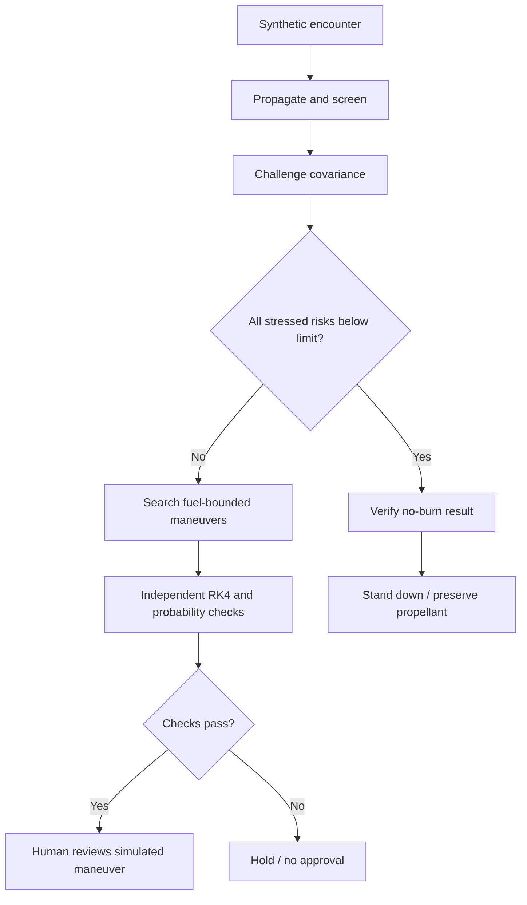

<div align="center">



**Orbital mechanics. Adversarial review. Human authority.**

An auditable mission-control simulator that detects a close approach, challenges its uncertainty, searches avoidance maneuvers, and independently checks the result.

[](https://github.com/Manoj-619/incident-zero/actions?query=branch%3Aorbit-sentinel)


[Quick start](#launch-mission-control) · [The mathematics](docs/NUMERICS.md) · [Architecture](docs/ARCHITECTURE.md) · [Operations](docs/OPERATIONS.md) · [Contribute](CONTRIBUTING.md)

</div>

---

### Space is unforgiving. Decisions shouldn’t be opaque.

A small nominal miss distance is not enough to justify a burn. A wide miss is not enough to dismiss a warning. Orbit uncertainty, fuel cost, and the next encounter all matter.

**ORBIT SENTINEL turns that tradeoff into an inspectable workflow.** Every probability comes from a numerical tool. Every candidate is screened against every listed object. An independent verifier can reject the planner. A human accepts the simulated maneuver.

<div align="center">

<sub>Actual recorded numerical output rendered as an orthographic mission projection. This is a presentation visualization, not a dashboard screencast or live spacecraft telemetry.</sub>
</div>

### One encounter. A measurable change.

The bundled crossing case uses fictional ECI states and explicitly synthetic covariance. With a 1 m/s budget and a 10⁻⁴ acceptance threshold:

| Evidence | Before | Selected maneuver |
|:---|---:|---:|
| Nominal miss distance / primary encounter | 35.47 m | 226.01 m |
| Nominal collision probability / primary encounter | 1.678 × 10⁻² | 1.124 × 10⁻⁹ |
| Worst probability across covariance stress cases / primary encounter | See recorded evidence | 7.601 × 10⁻⁵ |
| Impulse magnitude | 0 m/s | 0.298 m/s |
| Catalog objects checked | 2 | 2 |
| Decision | Search required | Verified; human approval pending |

**These probabilities are conditional on the synthetic Gaussian uncertainty and simplified physics. They are not operational collision predictions.** The finite search finds a low-cost evaluated maneuver; it does not prove global optimality.

### Four roles. Bounded authority.

| Role | Tool responsibility | Evidence produced |
|:---|:---|:---|
| **Tracker** | Propagate states and covariance; refine closest approaches | TCA, nominal miss, relative speed, encounter geometry |
| **Risk analyst** | Evaluate collision probability and challenge covariance size | 0.5× / 1× / 2× sigma stress cases |
| **Maneuver planner** | Search burn times, RTN axes, signs, and magnitudes | Candidate frontier, fuel cost, follow-on encounters |
| **Verifier** | Repeat trajectory integration and probability calculation independently | Agreement checks, threshold checks, Monte Carlo diagnostic |



**Numerical mode** is deterministic orchestration and works without an API key. **Gemini-assisted mode** uses the official Google Gen AI SDK to select a bounded search policy and return a cited review. The model cannot calculate authoritative probabilities, relax the verifier, authorize a burn, or execute code.

### Mission control, built for inspection

- **Interactive 3D orbital theater** — real computed trajectories, mission-time scrubbing, baseline/maneuver comparison, and a cinema view.
- **Encounter-plane geometry** — projected Gaussian covariance, the 3σ ellipse, and combined hard-body disk.
- **Maneuver frontier** — fuel cost against worst stressed risk, including rejected candidates.
- **Live agent journal** — fetch-based SSE events with tool starts, evidence, progress, and decisions.
- **Human approval gate** — explicit review, server-enforced verification, and idempotent simulated acceptance.
- **Downloadable evidence report** — parameters, results, assumptions, and the event journal.
- **Three reproducible scenarios** — dangerous crossing, uncertainty trap, and a quiet orbit where no burn is required.
- **Standalone recorded demonstration** — fixed numerical outputs with an unmistakable replay label when the backend is absent.

### Mathematics that can be challenged

The engine integrates two-body dynamics and a 6×6 state-transition matrix with DOP853:

$$\ddot r=-\mu\frac{r}{\|r\|^3},\qquad P(t)=\Phi(t)P_0\Phi(t)^T.$$

Collision probability is the mass of a projected 2D Gaussian inside the combined hard-body disk:

$$P_c=\int_{\|u\|\le R}\mathcal N(u;m,C)\,du.$$

The planner uses polar Gauss–Legendre integration. The verifier uses **separate Cartesian adaptive quadrature** and **fixed-step RK4** for nominal trajectory checks. Seeded Monte Carlo includes a Wilson confidence interval; zero hits is never presented as proof of zero risk.

Read the [full numerical contract](docs/NUMERICS.md) for equations, tolerances, units, assumptions, and known limitations.

### Launch mission control

**Docker Compose**

```bash
git clone --branch orbit-sentinel --single-branch https://github.com/Manoj-619/incident-zero.git orbit-sentinel
cd orbit-sentinel
docker compose up --build -d --wait
```

Open **http://localhost:5173**. Numerical mode needs no credentials.

**Local development**

```bash
make install
```

Run the backend:

```bash
.venv/bin/uvicorn orbit_sentinel.api:app --host 127.0.0.1 --port 8000 --workers 1
```

In another terminal:

```bash
cd frontend
npm run dev
```

**Headless simulation**

```bash
.venv/bin/python -m orbit_sentinel.cli --scenario crossing --output mission.json
```

**Optional Gemini assistance**

Configure a fresh server-side `GEMINI_API_KEY`, an available `GEMINI_MODEL`, and `OPERATOR_SECRET`. See [.env.example](.env.example) and [operations](docs/OPERATIONS.md). Provider failures remain visible and never silently become a replay. The bundled evidence uses numerical mode; a successful live Gemini call is not claimed.

### Codebase map

| Area | Purpose |
|:---|:---|
| `backend/orbit_sentinel/physics/` | Dynamics, variational equations, probability, planning, verification |
| `backend/orbit_sentinel/agents/` | Auditable workflow and optional schema-validated Gemini advisor |
| `backend/orbit_sentinel/api.py` | Strict API, bounded worker, event streaming, ownership |
| `backend/orbit_sentinel/store.py` | SQLite evidence journal, atomic approval, quota and retention |
| `backend/tests/` | Physics oracles, workflow behavior, provider contracts, API isolation |
| `frontend/src/` | React/TypeScript dashboard, Three.js scene, SVG analysis plots |
| `frontend/public/demo/` | CLI-generated numerical recordings |
| `docs/` | Numerical assumptions, architecture, operations, visual assets |
| `scripts/` | HTTP smoke check and evidence-based README animation renderer |

### Mission assurance

```bash
make test
make build
python scripts/smoke.py  # against a running Compose instance
```

The test suite checks conservation laws, finite-difference STM agreement, closed-form probability cases, independent numerical agreement, rejected corrupted evidence, no-burn decisions, insufficient budgets, capability isolation, atomic approval, provider gates, and streaming.

GitHub Actions runs numerical/API tests, the frontend production build, and a Docker/HTTP mission smoke test. The workflow badge shows the remote state; checked-in configuration alone does not imply that CI passed.

### Honest scope

This is an **educational research prototype and local/demo application**. It includes synthetic scenarios, two-body gravity, linearized covariance, short-encounter Gaussian risk, and deterministic impulses. It excludes live CDMs/TLE feeds, J2/drag/third-body effects, maneuver delivery uncertainty, spacecraft command transport, flight certification, and unrestricted catalog coverage.

The verifier challenges numerical consistency within the model. It does not establish physical truth. Public hosting requires the identity, abuse controls, and operational infrastructure described in [OPERATIONS.md](docs/OPERATIONS.md).

### Build the next orbit

Contributions welcome: orbital dynamics, covariance calibration, realistic maneuver uncertainty, CDM ingestion, rare-event estimation, stronger evaluations, accessible visualization, and deployment engineering.

Start with [CONTRIBUTING.md](CONTRIBUTING.md). Every new claim should come with evidence; every new model assumption should be visible.

<div align="center">

**MODEL-BOUND EVIDENCE. HUMAN-OWNED DECISIONS.**

Built by [Manoj Abraham](https://github.com/Manoj-619)

</div>
