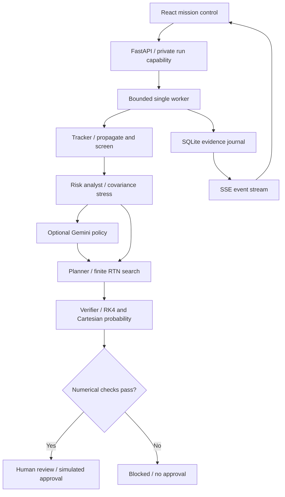

# Architecture and tool authority

The numerical mode is a deterministic four-role workflow. It does not call an LLM. Optional Gemini-assisted mode adds live policy selection and a cited narrative review. Both modes use identical physics tools and acceptance gates.

## Responsibilities

| Module | Owns | Cannot do |
|---|---|---|
| `physics/dynamics.py` | ECI state, STM, burn discontinuity, TCA | Invent telemetry or fetch live orbit data |
| `physics/probability.py` | Gaussian disk integration, independent quadrature, Monte Carlo | Declare probabilities model-independent |
| `physics/planner.py` | Bounded candidate search across all catalog objects | Claim global optimality |
| `physics/verification.py` | Independent integrator, geometry agreement, risk/fuel gates | Certify flight readiness |
| `agents/workflow.py` | Ordered tool calls, evidence IDs, decisions | Bypass verifier or authorize commands |
| `agents/gemini.py` | Schema-validated search axes/times and cited review | Change thresholds, submit code, approve burns |
| `store.py` | Run ownership, atomic quota/approval, journal | Expose another capability's mission |
| `api.py` | Request validation, bounded scheduling, SSE, report | Execute a spacecraft maneuver |

## State machine

A mission enters `running`. Its terminal computation state is `approval_pending`, `no_burn`, `blocked`, or `failed`. Only `approval_pending` with a passed verifier can transition to `approved`, inside a SQLite immediate transaction. Repeated approval is idempotent. No external command transport exists.

## Provider boundaries

Two maximum SDK requests per Gemini mission: a bounded planning policy and a cited review. Each uses a 20-second timeout, one SDK attempt, schema validation, and a 1,800 output-token cap. Invalid responses or unavailable providers cause the mission to fail; they are never relabeled as successful AI results. A Gemini reviewer may still write an inaccurate sentence despite valid citations: numeric evidence and the verifier remain authoritative, and semantic citation entailment is not automatically proven.

Gemini policy can narrow the search axes and burn times. This materially affects which candidates are evaluated and can miss a feasible direction. It cannot alter the fixed covariance stress cases, budget, risk threshold, verifier, or human gate. A no-burn scenario does not need a maneuver search, although Gemini mode still obtains a policy and review.

## Concurrency and retention

Run with **one Uvicorn process**. One numerical mission executes at a time; one additional mission may wait. Capacity and rolling quota are bounded (12 starts/hour per database, including failures). The worker has a 120-second cooperative computation budget; checks occur at workflow events and between search time groups, not within individual SciPy calls. Restarts mark unfinished runs as failed.

The SQLite journal retains capability-accessible runs for 24 hours; expired terminal records are purged on new starts. The UI stores a random capability in `sessionStorage`. Operator secrets are held in React memory and Gemini keys remain server-side. This is anonymous capability access, not user accounts, RBAC, or organization tenancy.

## Recorded mode

`frontend/public/demo/*.json` are numerical outputs generated by the CLI. The standalone frontend plays these fixed records with an animated journal. It labels them as recorded runs, locks parameter controls, and simulates approval locally. It does not contact Gemini, recompute orbits, or persist approval. With the backend connected, the same frontend requests fresh computations and server-enforced approval.
